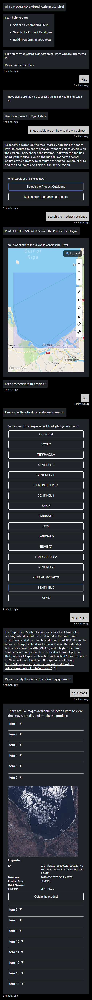

# Example Conversation #1
This conversation illustrates how the VAS Prototype can assist a climate researcher in locating historical satellite images of the Gulf of Riga to monitor ice coverage. The user begins by defining the region of interest and seeks guidance on drawing a polygon on the map. After specifying the data catalogue and the desired date, the system provides image previews, allowing the user to request full products if needed.
