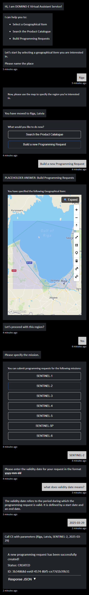

# Example Conversation #2
This conversation demonstrates how the VAS Prototype supports a climate researcher in ordering new satellite images of the Gulf of Riga for ice coverage monitoring. The user starts by defining the region of interest and selecting an Earth Observation mission. They inquire about meaning of parameters and specify the validity date for the programming request. Once the mission and date are confirmed, the system submits the request to the Coverage Service, providing updates on its success, status, and request ID.
